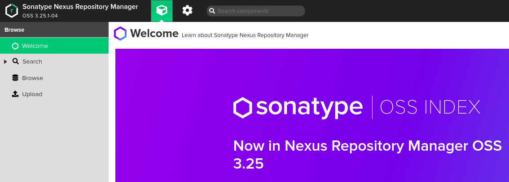
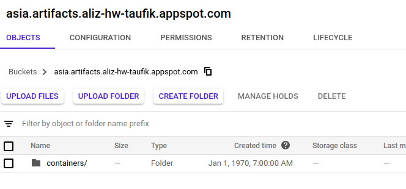

# Nexus
Sonatype Nexus Repository Manager with Nexus Blobstore Google Cloud plugin

The objective is to run a Nexus application on GCP Kubernetes that can save the uploaded artifacts in Cloud Storage

## Requirements

- Enable Container Registry, Kubernetes Engine, and Cloud Resource Manager API
- [Docker](https://docs.docker.com/get-docker/)
- [Terraform](https://learn.hashicorp.com/terraform/getting-started/install.html) create the Cloud Storage Bucket and the Kubernetes Cluster 
- [gcloud command-line tool](https://cloud.google.com/sdk/docs/quickstarts) for interacting with Google Cloud products and services
- [kubectl](https://kubernetes.io/docs/tasks/tools/install-kubectl/) for interacting with k8s cluster
- [helm](https://helm.sh/docs/intro/install/) cli to install nexus chart

## Setup

1. Create new project in GCP
2. Git clone repository
```bash
git clone https://github.com/mtaufikromdony/tf-gke-nexus.git
```
3. Enable Container Registry, Kubernetes Engine, and Cloud Resource Manager API using gcloud command-line tool
```bash
gcloud services enable compute.googleapis.com
gcloud services enable servicenetworking.googleapis.com
gcloud services enable cloudresourcemanager.googleapis.com
gcloud services enable container.googleapis.com
```
4. Build and push custom docker image to Container Registry
```bash
docker build -t asia.gcr.io/gcp-project/nexus3-gcp:0.1 .
docker push asia.gcr.io/gcp-project/nexus3-gcp:0.1
```
5. Navigate to `terraform` directory, review/update reguired values in `variables.tf`

6. Run `terraform init && terraform plan`. Review plan then apply by `terraform apply -auto-approve`
7. Get credentials for newly created cluster:

```bash
gcloud container clusters get-credentials cluster-name --region region --project project-id
```

8. Update helm values `003-Kubernetes/nexus/values.yaml` with actual repo and tag:

```yaml
image:
  repository: asia.gcr.io/gcp-project/nexus3-gcp
  tag: "0.1"
```
or using kubectl to apply deployment
```bash
cd ../003-Kubernetes/
kubectl apply -f Namespace.yaml
kubectl apply -f PersistentVolume.yaml
kubectl apply -f PersistentVolumeClaim.yaml
kubectl apply -f Deployment.yaml 
kubectl apply -f Service.yaml
```
9. Deploy nexus using `helm` :

```bash
helm install --debug  nexus ./nexus
```

output
```bash
NOTES:
Get the application URL by running these commands:
     NOTE: It may take a few minutes for the LoadBalancer IP to be available.
           You can watch the status of by running 'kubectl get --namespace default svc -w nexus'
  export SERVICE_IP=$(kubectl get svc --namespace default nexus --template "{{ range (index .status.loadBalancer.ingress 0) }}{{.}}{{ end }}")
  echo http://$SERVICE_IP:80
```
10. Log in to Nexus using k8s nexus service external IP (username admin & password admin123)

Here's how it will look like nexus in the browser: 

And Artifacts in GCS


## CI/CD

CI/CD can be implemented with veried of tools and approaches (Cloudbuild, Jenkins, Gitlab CI, Circle CI, and many more).
The main idea is to have related pipeline file(s) inside source repository with neccessary definitions for all required steps which should be executed and set a trigger(s) for particular branch(es). So any new commits into target branch will start configured steps like tests, build and push artifacts, update configurations, rollout new releases to specific environments and send different notifications.

The process ended up looking like this:

Code pushed to all branches and pull requests:

Kick off a build on CI Tools (examples: Jenkins)
Run all unit, integration, and end-to-end tests

Code pushed to master branch only:

- Build a Docker image based on the current code, settings, and environment
- Deploy the image to Google Container Registry or Docker Hub
- Connect to production server
- Pull the image from Google Container Registry or Docker Hub
- Stop the current container and start a container based on the new image
